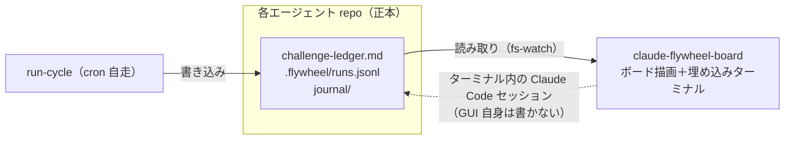

# claude-flywheel-board

[claude-flywheel](https://github.com/masanami/claude-flywheel) で運用する **fleet（複数の自律エージェント）を 1 画面で観測・操縦するローカル GUI** です。

複数エージェントが同時に自走し、差し込みタスクも走る運用では、「**だれが・どのタスクを・いまどうしているか**」がファイルを開いて回らないと分からない。claude-flywheel-board はこの課題を解決します。

## コンセプト

- **観測 ＋ 操縦席**: エージェントごとの縦カラムにタスクを積み、埋め込みターミナルから直接 Claude Code を操作する。
- **ファイルが正本、ボードは投影**: 各エージェント repo の `challenge-ledger.md` / `runs.jsonl` / `journal/` を読み取って描画するだけ。**ボード自身は状態ファイルに一切書き込まない**。書き込みはすべて埋め込みターミナル内の Claude Code セッション経由（既存の規律のまま）。
- **完全にオプショナル**: ボードを止めても flywheel の自走（cron の run-cycle）には一切影響しない。

*図: 位置づけ — claude-flywheel（制御プレーン）が書くファイルを、board（観測プレーン）が読み取って投影する。書き込みは埋め込みターミナル経由のみ。*



## ドキュメント

| ドキュメント | 内容 |
| --- | --- |
| [docs/requirements.md](docs/requirements.md) | 要件定義（What） |
| [docs/architecture.md](docs/architecture.md) | アーキテクチャ（How） |

## セットアップ

### 前提

| 依存 | 必須 | 用途 |
| --- | --- | --- |
| Node.js **22.18 以上**（v24 で開発・検証済み） | ✅ | サーバ実行（TypeScript を直接実行するため type stripping が必要） |
| **tmux** | ✅（ターミナル機能に） | 埋め込みターミナルのバックエンド。`brew install tmux`。**未インストールだとボード表示は動くが、ターミナルタブの接続が失敗する** |
| npm | ✅ | 依存インストール |

> tmux を採用している理由: board やブラウザを閉じても Claude Code セッションが生存し（re-attach 可能）、`tmux attach -t flywheel-<agent>` で手元のネイティブターミナルからも同じセッションを併用できるため。

### 手順

```bash
npm install

# fleet マニフェストを作成（既定パス。1 行 = <エージェント名><TAB><repo ローカルパス>）
mkdir -p ~/.flywheel
cat > ~/.flywheel/fleet.tsv <<'EOF'
# <name>	<path>
medical	/path/to/medical-agent
bi	/path/to/bi-agent
EOF

# 起動（開発）
npm run dev

# 起動（ビルド済みを配信）
npm run build
node src/server/index.ts
```

- ブラウザで http://127.0.0.1:4317 を開く（サーバは 127.0.0.1 にのみバインドされます）
- マニフェストのパスは環境変数 `FLYWHEEL_FLEET_MANIFEST` で上書きできます

## claude-flywheel との関係

- 本リポジトリは **claude-flywheel 本体（プラグイン）とは別配布**。プラグインは全エージェント repo に install されるが、board は人間が 1 箇所で起動する。
- 両者の契約は**ファイルフォーマット仕様**（`challenge-ledger-format.md`、`runs.jsonl` スキーマ等）。正本仕様は claude-flywheel 側 docs に置き、board はその消費者となる。

## ステータス

**P1〜P3 の全フェーズが main にマージ済み**です（要件定義の受け入れ基準を満たす初版が完成）。

- ✅ **P1 fleet ボード（観測）**: カラム表示・承認待ちハイライト・カード詳細/作業ログ・ライブ反映・パースエラー可視化
- ✅ **P2 常設ターミナル（操縦）**: tmux 永続セッション・タブ切替・D&D/差し込み → 指示プリフィル
- ✅ **P3 実行中パネル**: runs.jsonl 由来の実行中表示・⚠応答なし警告・再開コマンドの prefill 連携
- 📋 フォローアップ: [open issues](https://github.com/masanami/claude-flywheel-board/issues) を参照（キーボード操作性・バックプレッシャー・表示残骸・cache 責務分離）
