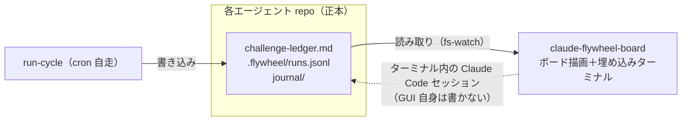

# claude-flywheel-board

[claude-flywheel](https://github.com/masanami/claude-flywheel) で運用する **fleet（複数の自律エージェント）を 1 画面で観測・操縦するローカル GUI** です。

複数エージェントが同時に自走し、差し込みタスクも走る運用では、「**だれが・どのタスクを・いまどうしているか**」がファイルを開いて回らないと分からない。claude-flywheel-board はこの課題を解決します。

## コンセプト

- **観測 ＋ 操縦席**: エージェントごとの縦カラムにタスクを積み、埋め込みターミナルから直接 Claude Code を操作する。
- **ファイルが正本、ボードは投影**: 各エージェント repo の `challenge-ledger.md` / `runs.jsonl` / `journal/` を読み取って描画するだけ。**ボード自身は状態ファイルに一切書き込まない**。書き込みはすべて埋め込みターミナル内の Claude Code セッション経由（既存の規律のまま）。
- **完全にオプショナル**: ボードを止めても flywheel の自走（cron の run-cycle）には一切影響しない。

*図: 位置づけ — claude-flywheel（制御プレーン）が書くファイルを、board（観測プレーン）が読み取って投影する。書き込みは埋め込みターミナル経由のみ。*

## ドキュメント

| ドキュメント | 内容 |
| --- | --- |
| [docs/requirements.md](docs/requirements.md) | 要件定義（What） |
| [docs/architecture.md](docs/architecture.md) | アーキテクチャ（How） |

## claude-flywheel との関係

- 本リポジトリは **claude-flywheel 本体（プラグイン）とは別配布**。プラグインは全エージェント repo に install されるが、board は人間が 1 箇所で起動する。
- 両者の契約は**ファイルフォーマット仕様**（`challenge-ledger-format.md`、`runs.jsonl` スキーマ等）。正本仕様は claude-flywheel 側 docs に置き、board はその消費者となる。

## ステータス

🌱 立ち上げ期。要件・設計ドキュメントを整備中です。
