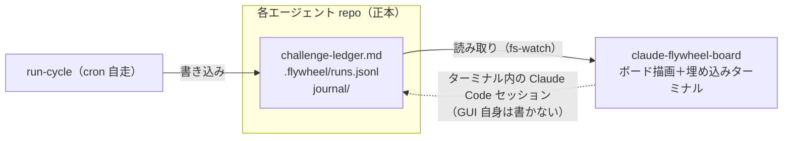

# claude-flywheel-board

[claude-flywheel](https://github.com/masanami/claude-flywheel) で運用する **fleet（複数の自律エージェント）を 1 画面で観測・操縦するローカル GUI** です。

複数エージェントが同時に自走し、差し込みタスクも走る運用では、「**だれが・どのタスクを・いまどうしているか**」がファイルを開いて回らないと分からない。claude-flywheel-board はこの課題を解決します。

## コンセプト

- **観測 ＋ 操縦席**: エージェントごとの縦カラムにタスクを積み、埋め込みターミナルから直接 Claude Code を操作する。
- **ファイルが正本、ボードは投影**: 各エージェント repo の `challenge-ledger.md` / `runs.jsonl` / `journal/` を読み取って描画するだけ。**ボード自身は状態ファイルに一切書き込まない**。書き込みはすべて埋め込みターミナル内の Claude Code セッション経由（既存の規律のまま）。
- **完全にオプショナル**: ボードを止めても flywheel の自走（cron の run-cycle）には一切影響しない。

*図: 位置づけ — claude-flywheel（制御プレーン）が書くファイルを、board（観測プレーン）が読み取って投影する。書き込みは埋め込みターミナル経由のみ。*


```mermaid
flowchart LR
    subgraph agents["各エージェント repo（正本）"]
        files["challenge-ledger.md<br/>.flywheel/runs.jsonl<br/>journal/"]
    end
    cycle["run-cycle（cron 自走）"] -->|書き込み| files
    files -->|読み取り（fs-watch）| board["claude-flywheel-board<br/>ボード描画＋埋め込みターミナル"]
    board -.->|"ターミナル内の Claude Code セッション<br/>（GUI 自身は書かない）"| files
```

## ドキュメント

| ドキュメント | 内容 |
| --- | --- |
| [docs/requirements.md](docs/requirements.md) | 要件定義（What） |
| [docs/architecture.md](docs/architecture.md) | アーキテクチャ（How） |

## セットアップ

### 前提

| 依存 | 必須 | 用途 |
| --- | --- | --- |
| Node.js **22.18 以上**（v24 で開発・検証済み） | ✅ | サーバ実行（TypeScript を直接実行するため type stripping が必要） |
| **tmux** | ✅（ターミナル機能に） | 埋め込みターミナルのバックエンド。`brew install tmux`（WSL2/Ubuntu は `sudo apt install tmux`）。**未インストールだとボード表示は動くが、ターミナルタブの接続が失敗する** |
| npm | ✅ | 依存インストール |

> tmux を採用している理由: board やブラウザを閉じても Claude Code セッションが生存し（re-attach 可能）、手元のネイティブターミナルからも同じセッションを併用できるため。board が発行する tmux コマンドは専用ソケット（`-L board`）に隔離されているため、ネイティブターミナルから attach する場合も `tmux -L board attach -t flywheel-<agent>` を使うこと（`-L board` を省略するとデフォルトソケットを見てしまい、セッションが見つからない）。
>
> **移行時の注意**: この隔離が導入される前にデフォルトソケット上で作成された既存の `flywheel-<agent>` セッションは、board の専用ソケットからは見えない（孤児化する）。board 起動後に古いセッションと新しいセッションが同一 repo に対して並存すると、片方のターミナル操作がもう片方の Claude Code セッションに伝わらなくなる。移行時は `tmux attach -t flywheel-<agent>` で旧セッションの作業を終えてから `tmux kill-session -t flywheel-<agent>` で終了し、board 側に新しいセッションを作らせること。

### 手順

```bash
npm install

# fleet マニフェストを作成（既定パス。1 行 = <エージェント名><TAB><repo ローカルパス>）
mkdir -p ~/.flywheel
cat > ~/.flywheel/fleet.tsv <<'EOF'
# <name>	<path>
medical	/path/to/medical-agent
bi	/path/to/bi-agent
EOF

# 起動（開発。HMR あり）
npm run dev

# 起動（利用。ビルド済みを単一オリジンで配信）
npm run start
```

- **開発（`npm run dev`）**: Vite 開発サーバ（http://127.0.0.1:5173）で HMR が効く。UI(5173) と API/WS サーバ(4317) は別オリジンだが、`vite.config.ts` の dev proxy が `/api`・`/ws`・`/ws/terminal` を 4317 へ転送するため、5173 をブラウザで開くだけで動く
- **利用（`npm run start`）**: `vite build` → `node src/server/index.ts` を1コマンドにまとめたもの（`npm run build && node src/server/index.ts` と同義）。ビルド済み UI を Hono が http://127.0.0.1:4317 で単一オリジン配信する
- ブラウザで開発時は http://127.0.0.1:5173、利用時は http://127.0.0.1:4317 を開く（サーバは常に 127.0.0.1 にのみバインドされます）
- マニフェストのパスは環境変数 `FLYWHEEL_FLEET_MANIFEST` で上書きできます

## WSL2 での運用（手順・制約・トラブルシュート）

> WSL2（Linux 側で board / Claude Code を実行し、Windows 側ブラウザで閲覧する構成）向けのガイドです。コードリーディングに基づくドラフトであり、**実機検証は未実施**です（Issue #118 の検証チェックリストを参照）。

### セットアップの差分（macOS との違い）

- **tmux**: `sudo apt install tmux`。
- **ビルドツール**: `node-pty` は Linux 向けのビルド済みバイナリを**同梱していない**（同梱は darwin / win32 のみ）ため、`npm install` 時に必ず node-gyp によるソースビルドが走る。事前に `sudo apt install build-essential python3` が必要（無いと `npm install` が失敗する）。
- **Node.js 22.18 以上**: Ubuntu の標準 apt では古いことが多い。[NodeSource](https://github.com/nodesource/distributions) か nvm / fnm 等でインストールする。
- macOS 向けの `postinstall`（`chmod +x .../darwin-*/spawn-helper`）は Linux では対象が無く `|| true` で無害に素通りする。対応不要。

### repo は Linux ファイルシステム側に置く（必須）

fleet.tsv に登録する各エージェント repo は **Linux FS 側（`~/` 配下）に置くこと**。Windows FS 側（`/mnt/c` 等の drvfs マウント）では、**Windows 側アプリによる変更**の inotify イベントが WSL2 側に伝わらない（WSL の既知制約）。WSL 内の Linux プロセス（エージェント）による変更が確実に検知されるかも無保証（実機未検証）のため、イベントが届かない場合は board のライブ反映が成立しない:

- 台帳・runs.jsonl 等のボード反映（`watcher.ts`）: 5 分間隔でフル再スキャンを起動するフォールバックがあるため、**反映が数分単位（再スキャン間隔 5 分＋スキャン・配信の処理時間）で遅延**する（停止はしない）。
- md プレビューのライブ反映（`md/watch.ts`）: 再スキャンのフォールバックが無いため**完全に停止**する（開き直せば最新は読める）。

そもそも `/mnt` 配下は 9P 経由でファイル I/O 自体が大幅に遅く、git / npm の性能面でも WSL2 のベストプラクティスは Linux FS 側配置のため、board 固有の追加制約というより前提の明文化である。

### アクセス経路は localhost 経由のみ

Windows 側ブラウザからは **`http://127.0.0.1:4317`**（WSL2 の localhost フォワーディング経由）でアクセスする。WSL の IP 直打ち（`http://172.x.x.x:4317`）は設計上成立しない:

1. サーバは `127.0.0.1` に固定バインドされており（上書き手段は意図的に無い）、WSL の外向きインターフェースでは接続自体が拒否される。
2. 仮にポートプロキシ等で到達させても、Host / Origin ヘッダ検証（`localhost` / `127.0.0.1` のみ許可）が 403 で拒否する。
3. 仮にヘッダも偽装しても、secure context でなくなり `navigator.clipboard` が使えずコピー機能が全滅する。

### トラブルシュート

| 症状 | 原因の見込み | 対処 |
| --- | --- | --- |
| Windows ブラウザから `http://127.0.0.1:4317` に繋がらない | WSL2 の localhost フォワーディングはスリープ復帰・VPN 接続後に壊れることがある（既知の癖） | PowerShell で `wsl --shutdown` → WSL を再起動 → board を再起動 |
| ライブ反映されない（手動リロードでは最新が見える） | repo が `/mnt/` 配下にある | repo を Linux FS 側（`~/` 配下）へ移す（上記参照） |
| スリープ復帰後に ⚠（更新なし）や stale が誤表示される | WSL2 はスリープ復帰後に時計がずれる既知問題があり、実行中 Run の経過時間判定（タイムスタンプ比較）が一時的に狂う | 時計の補正（まず `sudo hwclock -s` で Windows ホスト時刻に即時同期。直らなければ `wsl --shutdown`）で自己回復する。判定は毎回再計算のため補正後 1 分以内に表示も直る。board は表示のみで状態ファイルへ書き込まないため実害は無い |
| `npm install` が node-pty のビルドで失敗する | `build-essential` / `python3` 不足 | `sudo apt install build-essential python3` |
| chokidar が `ENOSPC: System limit for number of file watchers reached` を出す | ディストリによっては `fs.inotify.max_user_watches` が小さい（board 自体の消費は repo あたり約 5 watch と少なく、通常は他プロセスとの合算で到達する） | `sudo sysctl fs.inotify.max_user_watches=524288`。恒久化する場合は `/etc/sysctl.d/99-flywheel.conf` に `fs.inotify.max_user_watches=524288` を記載し、`sudo sysctl --system` で反映する |

> **`wsl --shutdown` の注意**: 実行中の**全**ディストリビューションと WSL2 VM を即時終了する（graceful shutdown ではない）。tmux 内の Claude Code セッション・未保存の作業もすべて止まるため、作業を保存し、エージェントの自走サイクルが区切りのよいタイミングで実行すること。

## claude-flywheel との関係

- 本リポジトリは **claude-flywheel 本体（プラグイン）とは別配布**。プラグインは全エージェント repo に install されるが、board は人間が 1 箇所で起動する。
- 両者の契約は**ファイルフォーマット仕様**（`challenge-ledger-format.md`、`runs.jsonl` スキーマ等）。正本仕様は claude-flywheel 側 docs に置き、board はその消費者となる。

## ステータス

**P1〜P3 の全フェーズが main にマージ済み**です（要件定義の受け入れ基準を満たす初版が完成）。

- ✅ **P1 fleet ボード（観測）**: カラム表示・承認待ちハイライト・カード詳細/作業ログ・ライブ反映・パースエラー可視化
- ✅ **P2 常設ターミナル（操縦）**: tmux 永続セッション・タブ切替・D&D/差し込み → 指示プリフィル
- ✅ **P3 実行中パネル**: runs.jsonl 由来の実行中表示・⚠更新なし警告・再開コマンドの prefill 連携
- 📋 フォローアップ: [open issues](https://github.com/masanami/claude-flywheel-board/issues) を参照（キーボード操作性・バックプレッシャー・表示残骸・cache 責務分離）
