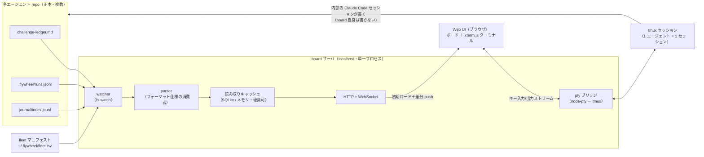
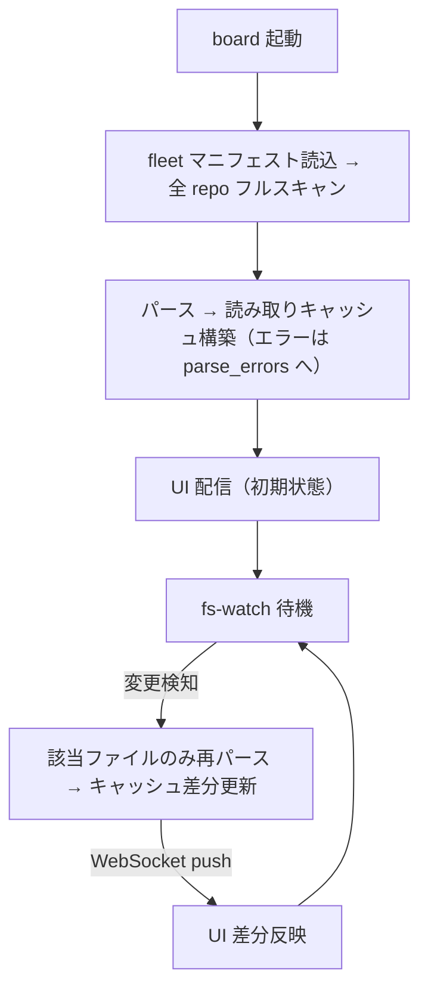

# アーキテクチャ — claude-flywheel-board

> 要件（[requirements.md](./requirements.md)）を **どう実現するか（How）** を定義する。
> 本書は実現方式・構成・主要フローを扱う。要件そのものの追加・変更は requirements.md 側で行う。

- ステータス: ドラフト
- 最終更新: 2026-07-16
- 関連: [requirements.md](./requirements.md) / claude-flywheel 側 [architecture.md](https://github.com/masanami/claude-flywheel/blob/main/docs/architecture.md)

---

## 1. 設計方針

1. **ファイルが正本、board は投影（projection）**: 各エージェント repo のファイル（台帳・runs.jsonl・journal）を読み取って描画する。board 内部の索引は**捨てて再構築できる読み取りキャッシュ**に限る（CQRS の簡易版。NFR-01/04）。
2. **GUI 自身は状態ファイルに書き込まない**: 書き込みはすべて**埋め込みターミナル内の Claude Code セッション**を通じて行われる。ターミナル内で起きることは、手元のシェルで `claude` を起動するのと完全に同一（同じ settings.json・同じ規律）。board は新しい書き込み経路を発明しない（NFR-01）。
3. **制御プレーンの依存にならない**: board が止まっても cron の run-cycle・委譲セッションは無傷（NFR-02）。逆方向の依存（board → ファイル読み取り）のみ許す。
4. **契約はファイルフォーマット**: 台帳・イベントログの仕様の正本は claude-flywheel 側 docs。board はその**消費者**であり、独自解釈を持ち込まない（NFR-05）。パースできないものはエラーとして表示する（FR-07）。
5. **ローカル 1 プロセス・追加インフラなし**: localhost の単一サーバプロセスに、ファイル監視・索引・Web UI 配信・pty ブリッジを同居させる（NFR-03/06）。

## 2. 全体構成

*図: 全体構成 — 各エージェント repo のファイルを watcher が監視し、パーサが読み取りキャッシュへ索引化、Web UI が購読する。ターミナルは pty ブリッジ経由で tmux セッションに接続し、書き込みはその中の Claude Code セッションだけが行う。*



## 3. コンポーネント

### 3.1 fleet マニフェスト

- board に登録するエージェント repo の一覧。**既定パス `~/.flywheel/fleet.tsv`**（起動引数 / 環境変数で上書き可）。
- 形式は claude-flywheel の `repos.tsv` と同じ思想（行指向・タブ/空白区切り・`#` コメント）で統一する:

```text
# <name>	<path>
medical	/Users/masami/agents/medical-agent
bi	/Users/masami/agents/bi-agent
infra	/Users/masami/agents/infra-agent
```

- エージェント repo 側には何も要求しない（board への登録はエージェントから不可視）。

### 3.2 watcher / parser

- fleet マニフェストの各 repo について、対象ファイル（§4 の契約）を fs-watch する。変更検知 → 該当ファイルのみ再パース → キャッシュ更新 → WebSocket で UI へ差分 push（FR-06）。
- パーサはファイル種別ごとに分離する（ledger / runs / journal）。**パース失敗は該当エントリを `parse_error` レコードとしてキャッシュに残し、UI がエラーカードとして表示**する（FR-07。黙って落とさない）。
- 起動時はフルスキャンでキャッシュを構築する。ウォッチ漏れ対策として低頻度（数分間隔）のフル再スキャンを併用する。

### 3.3 読み取りキャッシュ

- パース結果を保持し、UI のクエリ（fleet 横断の集計・フィルタ）に応える索引。**SQLite（単一ファイル）またはメモリ**。破棄しても正本から再構築できることが唯一の必須性質（NFR-04）。
- 主なエンティティ: `agents`（マニフェスト由来）/ `challenges`（台帳由来）/ `runs`（runs.jsonl 由来）/ `cycles`（journal 由来）/ `parse_errors`。
- 実行中の導出: `runs` のうち start があり対応する end がないもの。経過時間がしきい値（§7 AO-02）を超えたら `stale`（応答なし・要確認）フラグを付ける（FR-05）。

### 3.4 Web UI（ボード）

レイアウトは**カラム＝エージェント**（縦割り）。各カラムの構成（FR-02〜04）:

| 位置 | 内容 | 出所 |
| --- | --- | --- |
| ヘッダ | エージェント名／サイクル状態（実行中・idle・⚠応答なし） | runs.jsonl（cycle_start/end） |
| 1 段目 | ⚡ 実行中: 課題 ID・委譲先 repo・経過時間（stale は ⚠） | runs.jsonl（delegate_start/end） |
| 2 段目 | 🔔 あなたの番: `計画承認待ち` / `完了確認待ち` のカード（ハイライト） | challenge-ledger.md |
| 3 段目 | タスクスタック: 残りの課題カード（ステータスバッジ・優先度・ポジション）をステータス順に | challenge-ledger.md |
| 末尾 | パースエラーカード（あれば） | parse_errors |

- fleet 横断フィルタ（「承認待ちのみ」等）はヘッダ上部のグローバルバーに置く（FR-04）。
- カードの操作はすべて「ターミナルを開く」系に限る（§3.5）。状態を変えるボタンは置かない（NFR-01）。

### 3.5 ターミナルブリッジ

- **実体**: UI 側 xterm.js ⇔ サーバ側 node-pty ⇔ **tmux**。
- **tmux をバックエンド**にする理由: board（サーバ・ブラウザ）を閉じてもセッションが生存し、re-attach できる（FR-11）。長時間の run-cycle・対話セッションと共存するため必須。
- **セッション規約**: tmux セッション名 `flywheel-<agent-name>`、cwd＝エージェント repo ルート。**1 エージェント = 1 永続セッション**を既定とし（FR-10）、必要時のみ追加 window を作る。
- **UI 動線**:
  - カラムヘッダ →「ターミナルを開く」: 該当エージェントのセッションに attach（なければ作成）。
  - タスクカード →「セッションを開く」: journal / runs.jsonl の session_id から `claude -p --resume <session-id>` を、cwd を委譲先クローン（`.flywheel/repos/<name>`）に合わせて**プリフィル**（実行はしない。Enter は人間が押す）（FR-12）。
  - カラムの「＋差し込み」: 該当エージェントのセッションを開くだけ。指示は人間が対話で出し、結果は台帳 / runs.jsonl 経由でボードに現れる（FR-13）。
- **書き込み境界**: board がコマンドを**自動実行することはない**（プリフィルまで）。実行主体は常に人間＋ターミナル内の Claude Code であり、権限は各 repo の settings.json がそのまま統治する。

## 4. データソースと契約

仕様の正本はすべて claude-flywheel 側 docs。board は消費者（NFR-05）。

| ソース | パス（エージェント repo 相対） | 仕様の正本 | board での用途 |
| --- | --- | --- | --- |
| 課題台帳 | `challenge-ledger.md` | `challenge-ledger-format.md`（仕様化済み） | タスクカード・承認待ち（FR-03/04） |
| 実行イベント | `.flywheel/runs.jsonl` | **claude-flywheel P0 で仕様化（未）** | 実行中・応答なし検知（FR-05）、resume 連携（FR-12） |
| サイクル履歴 | `journal/index.jsonl` | `templates/journal/README.md`（仕様化済み） | サイクル状態の補完・将来のタイムライン（OQ-03） |

### 4.1 runs.jsonl（参考ドラフト）

正本仕様は claude-flywheel 側で確定する。board が必要とする最小形の参考ドラフト:

```text
{"ts":"2026-07-16T10:00:00+09:00","event":"cycle_start","cycle":"2026-07-16-cycle"}
{"ts":"2026-07-16T10:05:12+09:00","event":"delegate_start","challenge":"C-044","repo":"net-config","session_id":"abc-123"}
{"ts":"2026-07-16T10:42:30+09:00","event":"delegate_end","challenge":"C-044","session_id":"abc-123","result":"reported"}
{"ts":"2026-07-16T10:45:00+09:00","event":"cycle_end","cycle":"2026-07-16-cycle"}
```

- board 側の要件: ①append-only の JSONL、②start/end の対応付けキー（session_id）、③challenge と repo への参照。これ以上は要求しない。
- 確定した仕様と食い違った場合は**正本仕様側を正**とし、board のパーサを追従させる。

## 5. 主要フロー

### 5.1 観測（起動 → ライブ反映）

*図: 観測フロー — 起動時にフルスキャンで索引を作り、以後はファイル変更を差分反映する。*



### 5.2 介入（応答なしセッションへの再開）

1. runs.jsonl の `delegate_start` に対応する `delegate_end` がなく、経過がしきい値超過 → カードに ⚠ 表示（FR-05）。
2. 人間がカードの「セッションを開く」を押す → 該当エージェントの tmux セッションに attach、cwd を委譲先クローンに合わせ `claude -p --resume <session-id>` をプリフィル（FR-12）。
3. 人間が Enter で再開し、対話で状況を確認・指示する。以降の状態変化はファイル経由でボードに反映される。

### 5.3 承認（対話経由）

1. 台帳ステータス `計画承認待ち` / `完了確認待ち` のカードが 🔔 グループに出る（FR-04）。
2. カードから該当エージェントのターミナルを開き、対話で承認を伝える（FR-20）。
3. エージェントが台帳を更新 → fs-watch でカードが前進する。board は承認状態を直接書かない。

## 6. 技術スタック（候補）

確定は実装開始時（AO-03）。方針は「枯れた部品の薄い組み合わせ」。

| 層 | 候補 | 備考 |
| --- | --- | --- |
| ランタイム | Node.js（TypeScript） | node-pty の実績優先。Bun は node-pty 互換が安定してから再検討 |
| サーバ | Hono または Express ＋ ws | HTTP（静的配信・API）＋ WebSocket（差分 push・pty ストリーム） |
| ファイル監視 | chokidar | macOS の FSEvents 対応 |
| キャッシュ | better-sqlite3 またはメモリ | 規模的にはメモリで足りる想定。SQL の使い勝手が欲しければ SQLite |
| UI | 軽量 SPA（Vite ＋ React または Svelte） | ボード＋ターミナルの 2 面のみ。デザインシステム不要 |
| ターミナル | xterm.js ＋ node-pty ＋ tmux | tmux はユーザー環境の前提依存（brew install tmux） |

## 7. 未決事項（AO）

- **AO-01**: fleet マニフェストの最終形（パス・エージェント表示名・アイコン等の追加属性を持たせるか）。requirements.md OQ-01。
- **AO-02**: 「応答なし」しきい値の既定値と設定方法（全体一律か、マニフェストでエージェントごとに指定か）。requirements.md OQ-02。
- **AO-03**: 技術スタックの確定（§6）。実装開始時に決める。
- **AO-04**: runs.jsonl 仕様の確定待ち（claude-flywheel P0）。確定後に §4.1 を正本参照に差し替える。
- **AO-05**: journal タイムライン（P4 候補）。requirements.md OQ-03。
