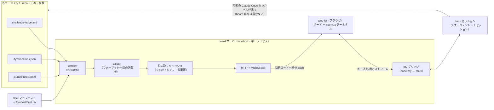
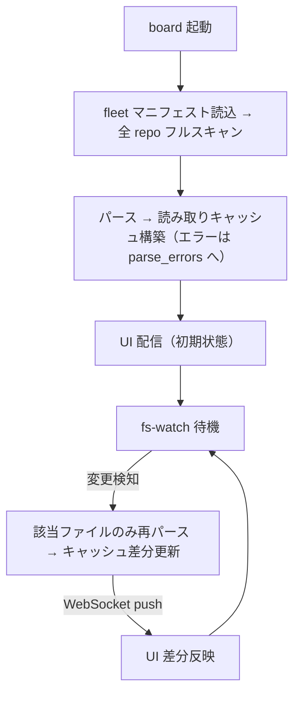

# アーキテクチャ — claude-flywheel-board

> 要件（[requirements.md](./requirements.md)）を **どう実現するか（How）** を定義する。
> 本書は実現方式・構成・主要フローを扱う。要件そのものの追加・変更は requirements.md 側で行う。

- ステータス: ドラフト
- 最終更新: 2026-07-16
- 関連: [requirements.md](./requirements.md) / claude-flywheel 側 [architecture.md](https://github.com/masanami/claude-flywheel/blob/main/docs/architecture.md)

---

## 1. 設計方針

1. **ファイルが正本、board は投影（projection）**: 各エージェント repo のファイル（台帳・runs.jsonl・journal）を読み取って描画する。board 内部の索引は**捨てて再構築できる読み取りキャッシュ**に限る（CQRS の簡易版。NFR-01/04）。
2. **GUI 自身は状態ファイルに書き込まない**: 書き込みはすべて**埋め込みターミナル内の Claude Code セッション**を通じて行われる。ターミナル内で起きることは、手元のシェルで `claude` を起動するのと完全に同一（同じ settings.json・同じ規律）。board は新しい書き込み経路を発明しない（NFR-01）。
3. **制御プレーンの依存にならない**: board が止まっても cron の run-cycle・委譲セッションは無傷（NFR-02）。逆方向の依存（board → ファイル読み取り）のみ許す。
4. **契約はファイルフォーマット**: 台帳・イベントログの仕様の正本は claude-flywheel 側 docs。board はその**消費者**であり、独自解釈を持ち込まない（NFR-05）。パースできないものはエラーとして表示する（FR-07）。
5. **ローカル 1 プロセス・追加インフラなし**: localhost の単一サーバプロセスに、ファイル監視・索引・Web UI 配信・pty ブリッジを同居させる（NFR-03/06）。

## 2. 全体構成

*図: 全体構成 — 各エージェント repo のファイルを watcher が監視し、パーサが読み取りキャッシュへ索引化、Web UI が購読する。ターミナルは pty ブリッジ経由で tmux セッションに接続し、書き込みはその中の Claude Code セッションだけが行う。*



## 3. コンポーネント

### 3.1 fleet マニフェスト

- board に登録するエージェント repo の一覧。**既定パス `~/.flywheel/fleet.tsv`**（起動引数 / 環境変数で上書き可）。
- 形式は claude-flywheel の `repos.tsv` と同じ思想（行指向・タブ/空白区切り・`#` コメント）で統一する:

```text
# <name>	<path>
medical	/Users/masami/agents/medical-agent
bi	/Users/masami/agents/bi-agent
infra	/Users/masami/agents/infra-agent
```

- エージェント repo 側には何も要求しない（board への登録はエージェントから不可視）。

### 3.2 watcher / parser

- fleet マニフェストの各 repo について、対象ファイル（§4 の契約）を fs-watch する。変更検知 → 該当ファイルのみ再パース → キャッシュ更新 → WebSocket で UI へ差分 push（FR-06）。
- パーサはファイル種別ごとに分離する（ledger / runs / journal）。**パース失敗は該当エントリを `parse_error` レコードとしてキャッシュに残し、UI がエラーカードとして表示**する（FR-07。黙って落とさない）。
- 起動時はフルスキャンでキャッシュを構築する。ウォッチ漏れ対策として低頻度（数分間隔）のフル再スキャンを併用する。

### 3.3 読み取りキャッシュ

- パース結果を保持し、UI のクエリ（fleet 横断の集計・フィルタ）に応える索引。**メモリ**（規模的に十分・NFR-04 により永続化不要のため SQLite は不採用）。破棄しても正本から再構築できることが唯一の必須性質（NFR-04）。
- 主なエンティティ: `agents`（マニフェスト由来）/ `challenges`（台帳由来）/ `runs`（runs.jsonl 由来）/ `cycles`（journal 由来）/ `parse_errors`。
- **複合キーの原則**: 正本はエージェント repo ごとに分散しており、課題 ID（例 `C-044`）は**エージェント内でのみ一意**。キャッシュ・API・UI は常に `(agent, challenge-id)` の複合キーで扱い、fleet 横断の集計でも ID 単独をキーにしない。
- **SQLite への移行トリガー**: キャッシュはインターフェース分離し（実装は cache モジュールに閉じる）、次のいずれかが現実になったら SQLite（キャッシュ用途・正本は変わらずファイル）へ差し替える — ①journal タイムライン（AO-05/P4）での履歴横断検索・ページング、②エージェント数・履歴増で起動フルスキャンやメモリが問題化、③全文検索の要求。それまではメモリを維持する。
- 実行中の導出: `runs` のうち start があり対応する end がないもの。経過時間がしきい値（§7 AO-02）を超えたら `stale`（応答なし・要確認）フラグを付ける（FR-05）。

### 3.4 Web UI（ボード）

レイアウトは**カラム＝エージェント**（縦割り）＋**画面下部の常設ターミナル**（§3.5）。各カラムの構成（FR-02〜04, 08, 09）:

| 位置 | 内容 | 出所 |
| --- | --- | --- |
| ヘッダ | エージェント名／サイクル状態（実行中・idle・⚠応答なし）／＋差し込み | runs.jsonl（cycle_start/end） |
| 1 段目 | 実行中: 課題 ID・委譲先 repo・経過時間（stale は ⚠＋再開ボタン） | runs.jsonl（delegate_start/end） |
| 2 段目 | 🔔 承認待ち: `計画承認待ち` / `完了確認待ち` のカード（ハイライト） | challenge-ledger.md |
| 3 段目 | スタック: 残りの課題カードを**優先度順**（位置＝優先度） | challenge-ledger.md |
| 末尾 | パースエラーカード（あれば） | parse_errors |

- カードは「タイトル＋メタ 1 行（ID・ステータス・ポジション）」の軽量表示。**ホバーで直近の作業要約、クリックで詳細モーダル**（台帳全項目＋作業ログタイムライン。journal / runs を課題 ID で突き合わせ・読み取り専用）（FR-08）。
- fleet 横断フィルタ（「承認待ちのみ」等）はヘッダ上部のグローバルバーに置く（FR-04）。
- **カードに状態を変えるボタンは置かない**（NFR-01）。唯一の操作は ⚠応答なしカード（と詳細モーダル）の「再開コマンドを挿入」＝プリフィルのみ（FR-12）。
- スタックのカード D&D 並べ替え・差し込みゴーストの位置指定は、**エージェントへの指示文としてターミナルにプリフィル**される（FR-09。§3.5）。board が台帳を書くことはなく、台帳が実際に更新されれば fs-watch でカードが移動する。

### 3.5 ターミナルブリッジ

- **実体**: UI 側 xterm.js ⇔ サーバ側 node-pty ⇔ **tmux**。
- **tmux をバックエンド**にする理由: board（サーバ・ブラウザ）を閉じてもセッションが生存し、re-attach できる（FR-11）。長時間の run-cycle・対話セッションと共存するため必須。
- **セッション規約**: tmux セッション名 `flywheel-<agent-name>`、cwd＝エージェント repo ルート。**1 エージェント = 1 永続セッション**を既定とし（FR-10）、必要時のみ追加 window を作る。
- **配置**: 画面下部を占有する**常設領域**。エージェントごとの**タブ**で切り替え、折りたたみ・高さ調整ができる（FR-10）。「開く」ボタンは置かない — カード・カラム起点の操作はすべて「該当タブをアクティブにしてプリフィル」に翻訳される。
- **UI 動線**:
  - ⚠応答なしカード／カード詳細 →「再開コマンドを挿入」: journal / runs.jsonl の session_id から `cd .flywheel/repos/<name> && claude -p --resume <session-id>` を該当タブに**プリフィル**（実行はしない。Enter は人間が押す）（FR-12）。
  - カラムの「＋差し込み」: スタック先頭にゴーストカードを置き、内容入力＋ドラッグで挿入位置（＝優先度）を指定 → 「台帳への追加指示」を該当タブにプリフィル（FR-09/13）。
  - スタックのカード D&D 並べ替え → 「優先度変更の指示」を該当タブにプリフィル（FR-09）。
  - 承認: 承認待ちカードで気づき、該当タブの対話で伝える（FR-20。カードに承認操作は置かない）。
- **書き込み境界**: board がコマンドを**自動実行することはない**（プリフィルまで）。実行主体は常に人間＋ターミナル内の Claude Code であり、権限は各 repo の settings.json がそのまま統治する。

## 4. データソースと契約

仕様の正本はすべて claude-flywheel 側 docs。board は消費者（NFR-05）。

| ソース | パス（エージェント repo 相対） | 仕様の正本 | board での用途 |
| --- | --- | --- | --- |
| 課題台帳 | `challenge-ledger.md` | `challenge-ledger-format.md`（仕様化済み） | タスクカード・承認待ち（FR-03/04） |
| 実行イベント | `.flywheel/runs.jsonl` | **仕様化済み: `templates/runtime/README.md`**（claude-flywheel PR #45） | 実行中・応答なし検知（FR-05）、resume 連携（FR-12）、差し込みの可視化（FR-13） |
| サイクル履歴 | `journal/index.jsonl` | `templates/journal/README.md`（仕様化済み） | カードのホバー要約・作業ログタイムライン（FR-08）、サイクル状態の補完 |

### 4.1 runs.jsonl（正本参照）

**正本**: claude-flywheel `templates/runtime/README.md`「実行イベントログ（runs.jsonl）」（PR #45 で確定）。board のパーサは正本に従い、以下は board の消費に関わる要点の抜粋:

- イベント 6 種: `cycle_start/end`・`delegate_start/end`・`adhoc_start/end`（差し込み作業も記録される）
- 「実行中」＝対応する `*_end` のない `*_start`。**対応付けキーはイベント種別ごと**: cycle は `cycle`（journal ファイル名 basename と機械突合可）、delegate は `session_id`（事前採番 UUID・小文字正規化）、adhoc は `id`
- **resume 規則**: 別サイクルへ持ち越した resume は同じ `session_id` の新しい `delegate_start` で挟まれる。対応付けは「同一 `session_id` の**最新の未終了 start**」
- `cycle_end` の `result` は `completed` / `abandoned`（stale ロック回収時の代筆）。**未終了 `adhoc_start` は代筆回収されない**ため、しきい値超過の要確認表示は board（消費者）の責務
- 破損行は「消費者がパースエラーとして可視化する前提」（FR-07 と整合）。ファイルは gitignore 対象のローカル実行状態（board は working tree を読むため影響なし）

## 5. 主要フロー

### 5.1 観測（起動 → ライブ反映）

*図: 観測フロー — 起動時にフルスキャンで索引を作り、以後はファイル変更を差分反映する。*



### 5.2 介入（応答なしセッションへの再開）

1. runs.jsonl の `delegate_start` に対応する `delegate_end` がなく、経過がしきい値超過 → カードに ⚠ 表示（FR-05）。
2. 人間がカードの「再開コマンドを挿入」を押す → 該当エージェントのターミナルタブがアクティブになり、`cd 委譲先クローン && claude -p --resume <session-id>` がプリフィルされる（FR-12）。
3. 人間が Enter で再開し、対話で状況を確認・指示する。以降の状態変化はファイル経由でボードに反映される。

### 5.3 承認（対話経由）

1. 台帳ステータス `計画承認待ち` / `完了確認待ち` のカードが 🔔 承認待ちグループに出る（FR-04）。
2. 該当エージェントのターミナルタブで対話し、承認を伝える（FR-20）。
3. エージェントが台帳を更新 → fs-watch でカードが前進する。board は承認状態を直接書かない。

### 5.4 差し込み・優先度変更（指示プリフィル）

1. 「＋差し込み」→ ゴーストカードに内容を入力し、ドラッグで挿入位置（＝優先度）を指定（FR-13）。既存カードの並べ替えも同じ D&D（FR-09）。
2. board が位置指定を指示文（例: 「課題 C-047 の優先度を C-044 より上に変更してください」）に翻訳し、該当タブにプリフィル。
3. 人間が Enter → ターミナル内のエージェントが台帳を更新 → fs-watch でカードが正式に移動する。board 自身は台帳を書かない（NFR-01）。

## 6. 技術スタック（確定）

2026-07-16 の機能定義（P1〜P3）時に確定（AO-03 クローズ）。方針は「枯れた部品の薄い組み合わせ」。

| 層 | 採用 | 備考 |
| --- | --- | --- |
| ランタイム | Node.js（TypeScript）＋ npm | node-pty の実績優先。Bun は node-pty 互換が安定してから再検討 |
| サーバ | Hono（@hono/node-server）＋ ws | HTTP（静的配信・API）＋ WebSocket（差分 push・pty ストリーム） |
| ファイル監視 | chokidar | macOS の FSEvents 対応 |
| キャッシュ | メモリ | 規模的に十分・NFR-04 により永続化不要のため SQLite は不採用 |
| UI | Vite ＋ React | ボード＋ターミナルの 2 面のみ。デザインシステム不要 |
| ターミナル | xterm.js ＋ node-pty ＋ tmux | tmux はユーザー環境の前提依存（brew install tmux） |
| テスト / リント | Vitest / Biome（lint＋format 一体） | 必須ゲート: lint・型チェック（tsc）・テスト |

## 7. 未決事項（AO）

- ~~**AO-01**~~ **確定**: fleet マニフェストは `~/.flywheel/fleet.tsv`・`<name>\t<path>` の 2 列＋`#` コメントのみ（§3.1 の通り）。表示名・アイコン等の追加属性は YAGNI で見送り、必要になったら列追加で対応。requirements.md OQ-01。
- ~~**AO-02**~~ **確定**: 「応答なし」しきい値は既定 30 分・全体一律。起動引数 / 環境変数で変更可能。エージェントごとの個別指定は必要になったらマニフェスト拡張で対応。requirements.md OQ-02。
- ~~**AO-03**~~ **確定**: 技術スタックは §6 の通り確定。
- ~~**AO-04**~~ **クローズ**（2026-07-16）: runs.jsonl 仕様は claude-flywheel PR #45 で確定。§4.1 を正本参照に差し替え済み。P3 の残依存は P2 のみ。
- **AO-05**: journal タイムライン（P4 候補）。requirements.md OQ-03。
