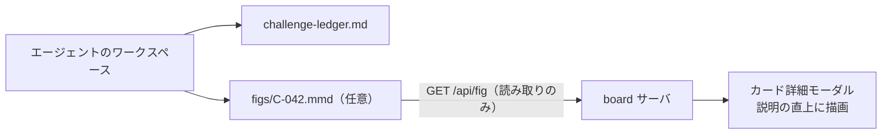

# 課題の一枚絵（fig）表示

## 概要

カード詳細モーダル（`CardDetailModal`）に、その課題を **1 枚の図で示す fig** を表示する（Issue #180・FR-14）。図の正本はエージェントのワークスペース直下 `figs/<課題ID>.mmd`（mermaid ソース）で、**board は読んで描画するだけ**（NFR-01）。

## 背景・目的

カード詳細は台帳の説明・タスク案・完了条件を**文章のみ**で表示しており、課題の全体像が頭に入らない。とくに計画承認（FR-13）の判断時は、承認対象（タスク案・完了条件・関連リポジトリ）を読み解くコストがそのまま承認の遅延になる。文章を読む前に構造を掴める一枚絵を置き、読み解きの入口を軽くする。

## 決定（Issue #180 の要検討事項に対する結論）

| 論点 | 決定 | 理由 |
| --- | --- | --- |
| 図の形式 | **mermaid**（`.mmd` ソース。コードフェンスで囲まない・1 ファイル 1 図） | 台帳と同じくテキストで書けて差分が追える。board は PreviewPanel で `securityLevel: 'strict'` の描画を既に持っており流用できる。画像形式（SVG/PNG）は生成・保存場所・参照方法の決定が新たに必要になるため採らない |
| 図の正本の置き場所 | **`<workspace>/figs/<課題ID>.mmd`**（台帳 `challenge-ledger.md` と同じワークスペース直下） | board は台帳を読むのと同じ経路（fleet マニフェストのパス）でそのまま読める。**台帳フォーマット（claude-flywheel `challenge-ledger-format.md`）へのフィールド追加は採らない**——追加すると claude-flywheel との横断課題になり、board 単独で閉じなくなる |
| board の書き込み | **しない**（読み取り専用） | NFR-01。fig はエージェント／人間がワークスペース側で書くファイルであり、board は投影に徹する |
| 表示位置 | カード詳細「課題台帳」セクションの**説明の直上** | 承認対象を先頭に置く並び（#151）は保ったまま、最も長い散文である説明を読み始める直前に全体像を出す |
| 図が無い課題 | **正常系**として扱い、図の行ごと描画しない（エラー表示もプレースホルダも出さない） | 図は本文の理解を助ける補助であり、無いこと自体は課題の欠陥ではない。従来どおりの文章表示のレイアウトを一切崩さないことを優先する |
| 描画失敗時 | **図の領域だけを畳む**（本文表示は維持） | 図の構文エラーでカード詳細（承認の判断材料）が読めなくなるのは本末転倒 |
| 安全性 | 既存方針の踏襲: mermaid `securityLevel: 'strict'`・生 HTML 無効 | 親 Issue #61 のクリティカル設計決定をそのまま適用する。描画コンポーネント（`MermaidDiagram`）は PreviewPanel と共用し、安全性の決定が複製されないようにする |

### 誰がいつ図を書くか（本機能では規定しない）

**当面は任意・手書き**とする。「分類時・タスク案作成時にエージェントが書く」といった運用の規定化は run-cycle 側（claude-flywheel）の変更になり、board 単独で閉じないため本機能のスコープ外（Issue #180 の要検討事項のうち、ここだけ意図的に未決のまま残している）。board 側は「図があれば出す・無ければ出さない」だけを保証する。

## 記法（fig を書く人向け）

- 置き場所: エージェントのワークスペース直下 `figs/`（例: `~/Tom/figs/C-042.mmd`）
- ファイル名: **課題 ID そのもの ＋ `.mmd`**（`C-042.mmd`。枝番 `C-042-1.mmd` も可）。課題 ID の形は台帳フォーマットの規定（`C-<数字>`、枝番はハイフン区切り）に従い、board は**この形に一致しない ID の fig を読まない**
- 中身: mermaid のソースそのもの（```` ```mermaid ```` のコードフェンスで囲まない）
- 1 ファイル 1 図。上限サイズ 256KB（手書き図には過剰なほどの余裕。上限超過は「図なし」として扱う）
- `figs/` は**任意**のディレクトリ。存在しなくても board は何も言わない



## 実装

| レイヤー | 実体 | 役割 |
| --- | --- | --- |
| 読み取り | `src/server/figs.ts` | `<workspace>/figs/<課題ID>.mmd` を読む。課題 ID 形式の検証・ワークスペース外への脱出（symlink 含む）の拒否・サイズ上限。不在も拒否も一律 `{ ok: false }` |
| API | `GET /api/fig?agent=<name>&challenge=<id>`（`src/server/api.ts`） | 200 `{ source }` / 404（図が無い・未知のエージェント・ID 形式違反・サイズ超過をすべて同じ 404 に潰す） |
| 描画 | `src/ui/components/MermaidDiagram.tsx` | mermaid の描画（strict・レンダリングの直列化・コンテナ隔離）。PreviewPanel と共用 |
| 表示 | `src/ui/components/ChallengeFig.tsx` | モーダルを開いたタイミングで fig をオンデマンド取得し、説明の直上に描画。取得・描画のいずれかが失敗したら `null` を返して畳む |

**取得を board スナップショット（`GET /api/board`）に載せない理由**: fig はカード詳細でしか使わない。fleet 全課題ぶんを常時キャッシュ・watch するのは読み取りキャッシュの肥大化に見合わない（YAGNI・NFR-04）。作業ログ（`GET /api/log`）と同じオンデマンド取得に揃える。

**ライブ更新の対象外**: `figs/` は fs-watch の対象にしていない。編集中の fig を board で追うには、モーダルを開き直す（再フェッチされる）。必要になったら別途検討する（YAGNI）。

## 受入基準

- [x] カード詳細モーダルで、課題に紐づく一枚絵が表示される（`src/ui/components/ChallengeFig.test.tsx`・`CardDetailModal.test.tsx`）
- [x] 図が無い課題では従来どおり文章のみで表示される（崩れない）
- [x] 図の形式（mermaid）と正本の置き場所（`figs/<課題ID>.mmd`）が決定され、ドキュメントに記録されている（本ドキュメント・requirements.md FR-14・architecture.md §4）
- [x] 表示・不在・描画失敗の 3 ケースがテストで固定されている
